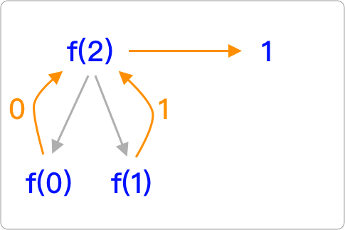
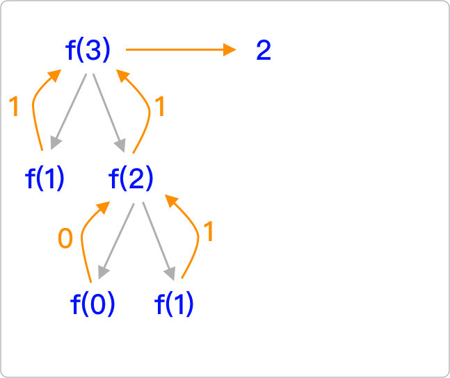
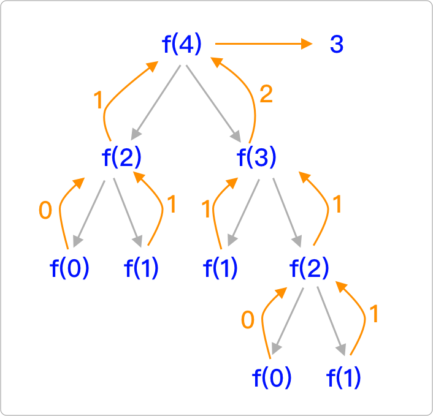

# 3.13 函式(Function)

在 `javascript/practice` 資料夾下，建立 `function.html` 來練習。

## 具名函式(named function)


### 函式的宣告與呼叫執行

```javascript
function my_function(){
  console.log("執行到這裡")
}
my_function(); // 執行到這裡
```

第 1 行：以 function 開頭，再空一格，輸入自訂的函式名稱，緊接著小括號、大括號。

第 2 行：該函式的被呼叫時，所要執行的程式，包在大括號裡。

第 3 行：函式的結束大括號。

第 4 行：函式的呼叫執行，函式名稱+小括號。


### 函式的參數

小括號裡，可以放參數。也就是函式在執行時，可以不帶參數(上例)，或帶1個以上的參數，以逗號做區隔。

```javascript
function add(a, b){
  console.log(a + " + " + b + " = " + (a + b));
}

add(2, 3);  // 2 + 3 = 5
add(8, 10); // 8 + 10 = 18


// 參數不足時，會有 undefined 的狀況，此例的 b 就是 undefined
add(8); // 8 + undefined = NaN
```


### 參數預設值

看以下例子，瞭解參數有預設值的寫法：

```javascript
function add(a = 1, b = 2){ // a 的預設值是 1；b 的預設值是 2
  console.log(a + " + " + b + " = " + (a + b));
}

add();      // 1 + 2 = 3
add(8);     // 8 + 2 = 10
add(8, 10); // 8 + 10 = 18
```


### 函式的回傳值

使用關鍵字 **return** 將結果回傳，同時也結束函式的執行：

```javascript
function subtraction(a, b){
  var result = a - b;
  return result; // 回傳結果，並結束函式的執行
  
  console.log("會執行到這行程式嗎"); // 不會
}

var my_num = subtraction(5, 2);
console.log("結果等於 " + my_num);

/*
結果等於 3
*/
```


## 匿名函式(Anonymous Function)

函式沒有名稱，就是匿名函式，通常這種情況，可以將匿名函式存在某個變數中：

```javascript
var my_function = function(a, b){
  var result = a + b;
  return result;
};

var function_reuslt = my_function(5, 2);
console.log("執行結果 " + function_reuslt);

/*
執行結果 7
*/
```


## 迴呼函式(Callback Function)

概念：某件事情執行完之後，執行另外一件事。


執行這段程式，試著解讀：

```javascript
function add(a, b, cb){
  let sum = a + b;
  return cb(sum, 2);
}
function division(sum, denominator){
  let avg = sum / denominator;
  return avg;
}

let result = add(4, 8, division);
console.log(result); // 6
```

換個寫法，以下的 匿名函式 就是 **Callback Function**：

```javascript
function add(a, b, cb){
  let sum = a + b;
  return cb(sum, 2);
}

// 第三個參數 function，就是一個 callback function
let result = add(6, 8, function(sum, denominator){
  let avg = sum / denominator;
  return avg;
});

console.log(result); // 7
```


## IIFE 即刻調用函式

IIFE = **`Immediately Invoked Function Expression`**

是一個定義完馬上就執行的函式。


### 具名函式的宣告

```javascript
function my_func(){
  console.log("執行這裡");
}
```

如果希望這個函式宣告完之後，馬上執行，且也只希望執行一次，也就是 IIFE，按照以下兩個步驟：

1. 用小括號包起來，表示避免函式的宣告。
2. 緊接著再加上小括號，表示要執行該函式。

```javascript
(function my_func(){
  console.log("執行這裡");
})();
my_func(); // 這裡可以繼續呼叫嗎？不行的，因為不存在該函式。
```


### 匿名函式

接續上例，也可以將函式的名稱移除，變成如下：

```javascript
(function(){
  console.log("執行這裡");
})();

/*
執行這裡
*/
```


### IIFE 帶入參數

```javascript
(function(a, b){
  console.log(a + " + " + b + " = " + (a + b));
})(100, 200);

/*
100 + 200 = 300
*/
```


### IIFE 回傳值

```javascript
var result = (function(a, b){
  return (a + " + " + b + " = " + (a + b));
})(50, 80);

console.log(result);

/*
50 + 80 = 130
*/
```


## 遞迴

在函式的內部呼叫自己本身。例：

```javascript
function test(){
  test();
}
```

請做以下的練習一瞭解遞迴。


## 練習1：倒數 10 秒

寫一個函式叫 count 函式，執行它的時候，帶一個秒數參數(假設是 10)，在 console 中顯示如下畫面：


提示，先介紹 setTimeout 寫法：

```javascript
setTimeout(function(){
  // 其它原始碼
}, 1000); // 1 秒之後，執行 function 裡的程式
```


從這裡開始寫：

```javascript
function count(i){

  setTimeout(function(){
    
  }, 1000);
  
}
count(10);
```


參考作法：




## 練習2：寫一個函式，將指定文字左邊補零

寫一個函式叫 strpad()，帶兩個參數。

* 第一個參數：任何正整數。
* 第二個參數：指定位數，若不足的話，左邊補 0。


部份原始碼如下：

```javascript
function str_pad(my_num, digits){
  // 寫在這裡
}

var result = str_pad(9, 2);
console.log(result); // 09

var result2 = str_pad(7, 3);
console.log(result2); // 007
```


參考作法：





累積自己的函式庫 **`my_funcs.js`**。



## 練習3：使用遞迴，費氏數列(Fibonacci numbers)

「費氏數列」：0、1、1、2、3、5、8、13、21、34……依此類推。

規則是：

* 第 0 項 是 0。
* 第 1 項是 1。
* 第 2 項開始，是前兩項的相加。


請寫一個 fibonacci() 函式，代入一個參數，代表第幾項(從 0 開始算)，就可以得知該項的數值。然後也在 console 中顯示 fibonacci 函式被執行了幾次。


部份原始碼：

```javascript
var i = 0;
function fibonacci(n){
  // 程式碼寫在這
}

console.log(fibonacci(0) + "。fibonacci 函式執行了 " + i + " 次");
```

上述原始碼執行到第 6 行時，在 console 中，應輸出如下訊息：

執行 fibonacci(0) →  得到 「0；fibonacci 函式執行了 1 次。」\
執行 fibonacci(1) → 得到 「1；fibonacci 函式執行了 1 次。」\
執行 fibonacci(2) → 得到 「1，fibonacci 函式執行了 3 次。」\
執行 fibonacci(3) → 得到 「2，fibonacci 函式執行了 5 次。」\
執行 fibonacci(4) → 得到 「3，fibonacci 函式執行了 9 次。」\
執行 fibonacci(5) → 得到 「5，fibonacci 函式執行了 15 次。」\
執行 fibonacci(6) → 得到 「8，fibonacci 函式執行了 25 次。」\
依此類推。


提示：

`fibonacci(0)` 及 `fibonacci(1)`：


`fibonacci(2)`：



`fibonacci(3)`：




`fibonacci(4)`：




參考作法：





累積自己的函式庫 **`my_funcs.js`**。

