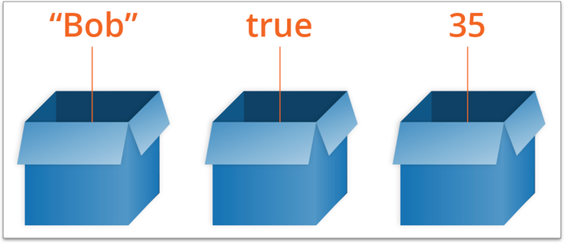
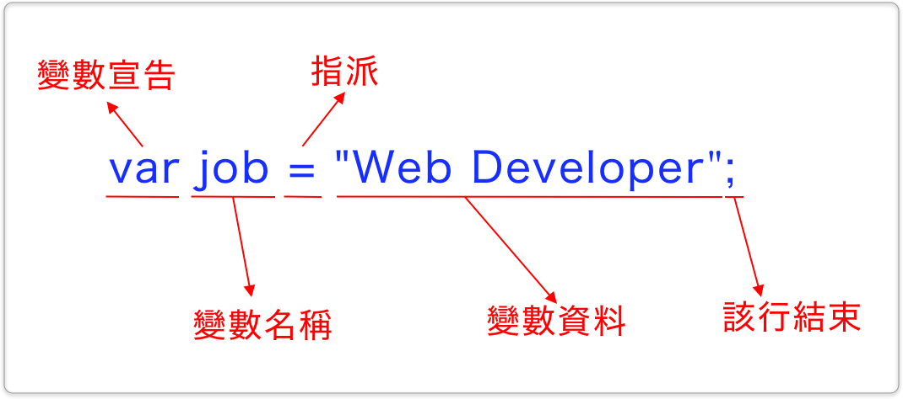

# 3.3 變數(Variable)

在 `javascript/practice` 資料夾下，建立 `variable.html` 檔案，以便練習。

## 變數概念

* 將變數想成是一個箱子，裡面一次只能裝一種東西(資料)。
* 可以將箱子裡的東西(資料)換成其它的。
* 東西(資料)可以是文字、數值等等不同的資料類型。



圖片出自於：[https://developer.mozilla.org/en-US/docs/Learn/JavaScript/First\_steps/Variables](https://developer.mozilla.org/en-US/docs/Learn/JavaScript/First\_steps/Variables)

## 語法概念



* 變數宣告：先使用 **`var`**，以後會再學到 `let` 與 `const`。
* 變數名稱：可自訂，名稱勿使用數字開頭。儘量用英文字當開頭。
* **`=`**：原文是 assign (指派)的意思，指的是將右邊的資料，指派給左邊的變數名稱，這樣的過程，就是賦值。所以並不是數學中的「等於」的意思。
* 變數資料：可儲存任何的資料給變數名稱，會有不同的資料類型，此處以雙引號括起，代表的是**`字串`**的意思。
* 最後的分號，表示該行程式碼的結束。


## 變數命名原則

* 可包含大小寫字母、數字、底線(`_`)、錢字符號(`$`)。
* 起始必須是字母或底線或錢字符號。
* 字母大小寫是不同的。變數 **`x`** 和變數 **`X`** 是視為不同的變數。
* 不能使用到[保留字](https://www.w3schools.com/js/js\_reserved.asp)。


## 指派(=)運算子

這邊認識到第一個運算子(operator)：**等號(`=`)**，在這裡是「指派(assignment)」運算子的意思。

這裡的等號並不是數學中 "比較" 的意思，如果是想要表達比較的意思，要用 `==` 或 `===`。

## 變數宣告

### var

方式一：宣告之後，直接賦值：

```javascript
var job = "web developer";
```

方式二：先宣告，之後再賦值：

```javascript
var job;
job = "web developer";
```


~~方式三~~：(禁用)，少寫了 var 關鍵字

```javascript
job = "web developer";
```


所以很多人會說 JavaScript 不是一個很嚴謹的程式語言。



var 宣告的變數可視範圍(scope)是函式(Function)。



### let

宣告方式與 **`var`** 相同。差別在於可視範圍(scope)。


let 宣告的變數可視範圍(scope)是區塊(Block)。



### const

常數(Constant)，一個變數若宣告成常數，就**不能再被改變**，而且在宣告的時候，就**要直接賦予其值**。例：

```javascript
const my_id = "abc123";
```


如果寫成以下這樣，會看到錯誤訊息：

```javascript
const my_id; // 沒有在宣告的時候賦予其值，會出錯。
my_id = "abc123";
```

錯誤訊息如下：


如果寫成這樣，會看到錯誤訊息：

```javascript
const my_id = "abc123";
my_id = "abc456"; // 試圖改變常數的值，會出錯。
```

錯誤訊息如下：



const 宣告的變數可視範圍(scope)是區塊(Block)，與 let 相同。



測試看看以下例子將 `var` 改成 `let` 和 const 看看：

```javascript
if(true){
  var a = 1;
}
console.log(a);
```

## 練習

輸入以下程式，觀察 console 的印出：

```javascript
var my_variable = "123";

console.log(my_variable);
console.log(window);
console.log(window.my_variable);
```



window 是預設在瀏覽器就有的，是頂層物件。

因為宣告位置的關係，我們自訂的 my\_variable 在此情況是**全域變數**，表示在網頁上的任何地方皆可使用。

